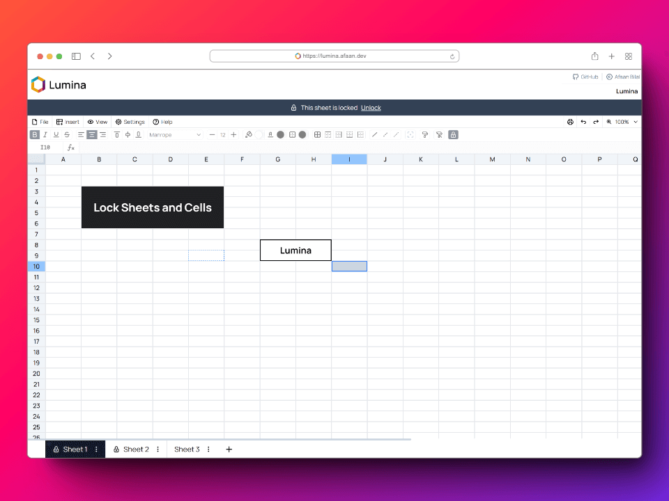
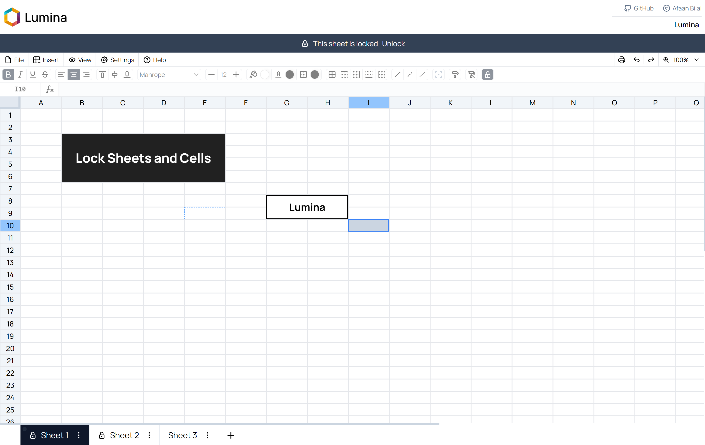
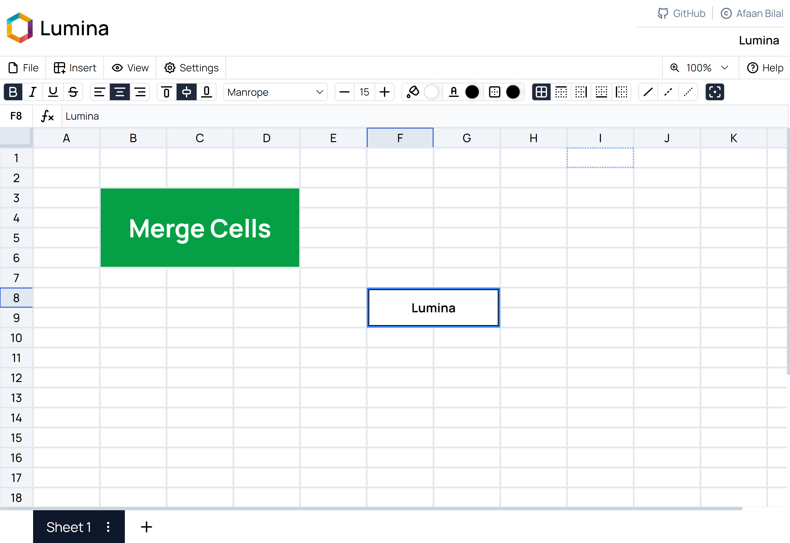
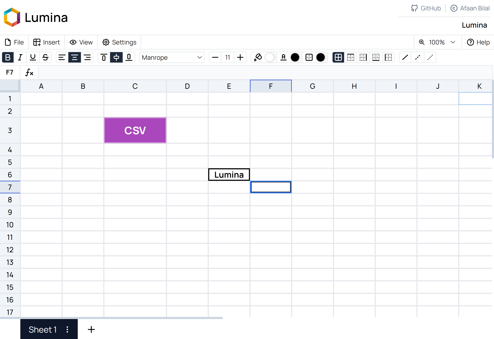
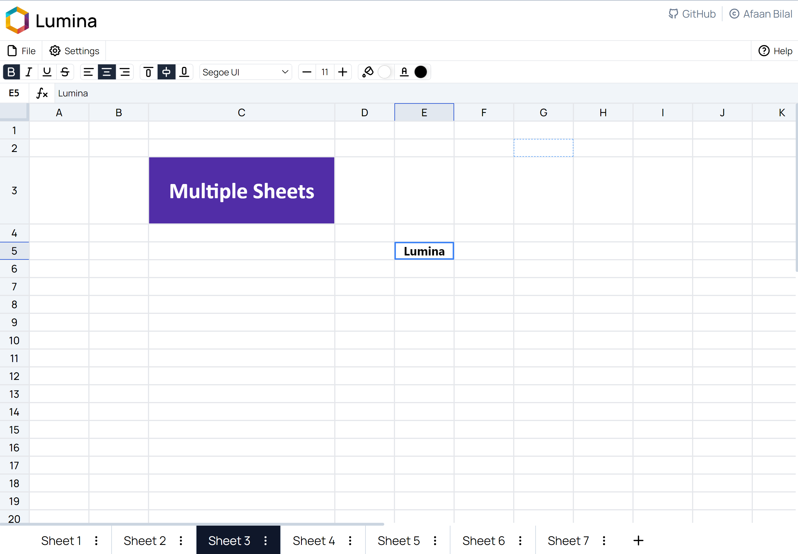
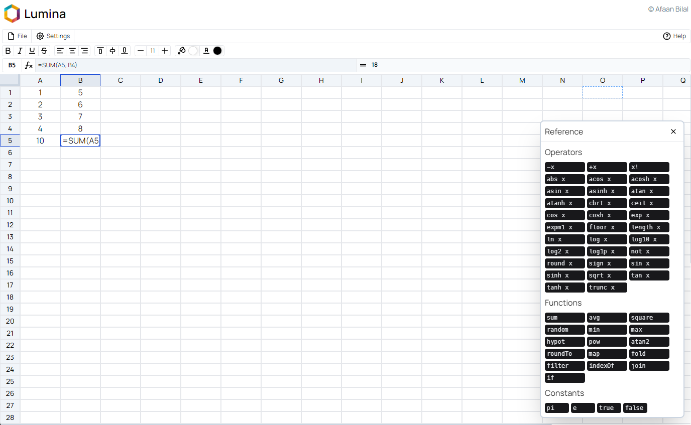
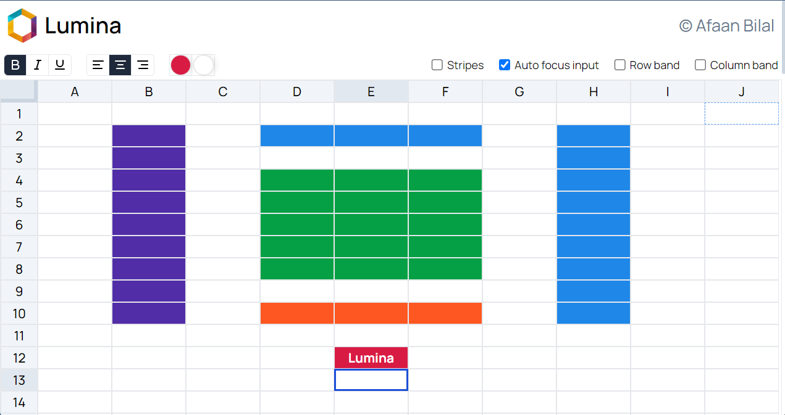

 Lumina
===============================================

Author: **[Afaan Bilal](https://afaan.dev)**

## Introduction
**Lumina** is a spreadsheet app written in Vue and Typescript with Pinia and Tailwind.

Try it here: **[lumina.afaan.dev](https://lumina.afaan.dev/)**

#### 🚧 Lumina is a work in progress.

---

## Screenshots

---

### Features
- [X] Spreadsheet grid
- [X] Multiple sheets
  - [X] Add sheet
  - [X] Sheet name
  - [X] Sheet color
  - [X] Move sheet left
  - [X] Move sheet right
  - [X] Delete sheet
- [X] File management
  - [X] Export JSON
  - [X] Import JSON
  - [X] Export CSV
  - [X] Import CSV
  - [X] Print
- [X] Insert
  - [X] Insert row above
  - [X] Insert row below
  - [X] Insert column left
  - [X] Insert column right
  - [X] Insert sheet
  - [X] Insert function
  - [X] Insert operator
- [X] View
  - [X] Style bar
  - [X] Formula bar
  - [X] Gridlines
  - [X] Stripes
  - [X] Row band
  - [X] Column band
  - [X] Show formulae
  - [X] Show hidden
- [X] Fullscreen
- [X] Settings
  - [X] Autofocus
- [X] Undo / Redo
- [X] Zoom
- [X] Help menu
- [X] Reference: operators, functions and constants
- [X] Formula bar
- [X] Formulae and expression evaluation by [expr-eval](https://github.com/silentmatt/expr-eval).
- [X] Additional functions
  - [X] SUM(...)
  - [X] AVG(...)
  - [X] SQUARE(x)
- [X] Cell references
  - [X] Direct: A1, A2, B1, C1, ...
  - [X] Range: A1:A10, C1:E5
- [X] Styling
  - [X] Bold
  - [X] Italic
  - [X] Underline
  - [X] Strikethrough
  - [X] Background color
  - [X] Text color
  - [X] Text alignment
  - [X] Vertical alignment
  - [X] Font family
  - [X] Font size
  - [X] Borders
  - [X] Border color
  - [X] Border type
- [X] Selection
  - [X] Select a cell
  - [X] Select a series of cells (column)
  - [X] Select a series of cells (row)
  - [X] Select a series of cells (grid)
  - [X] Select whole row
  - [X] Select whole column
  - [X] Select whole sheet
- [X] Sheet management
  - [X] Add row (end)
  - [X] Add row (middle)
  - [X] Delete row
  - [X] Move row up
  - [X] Move row down
  - [X] Add column (end)
  - [X] Add column (middle)
  - [X] Delete column
  - [X] Move column left
  - [X] Move column right
- [X] Freezing
  - [X] Frozen rows
  - [X] Frozen columns
- [X] Locking
  - [X] Lock cells
  - [X] Lock sheets
- [X] Hiding
  - [X] Hide rows
  - [X] Hide columns
- [X] Merging
  - [X] Merge cells (same row)
  - [X] Merge cells (same column)
  - [X] Merge cells (grid)
- [X] Paint format
- [X] Clear format
- [X] Sizing
  - [X] Row height
  - [X] Column width
- [X] Basic settings
  - [X] Striped Grid
  - [X] Auto focus input
  - [X] Row Bands
  - [X] Column Bands

---

## Contributing
All contributions are welcome. Please create an issue first for any feature request
or bug. Then fork the repository, create a branch and make any changes to fix the bug
or add the feature and create a pull request. That's it!
Thanks!

---

## License
**Lumina** is released under the MIT License.
Check out the full license [here](LICENSE).
