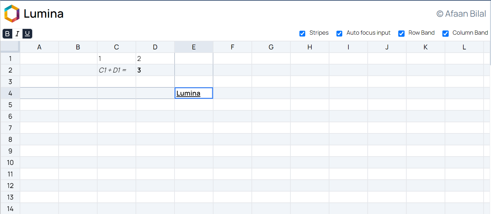

 Lumina
===============================================

Author: **[Afaan Bilal](https://afaan.dev)**

## Introduction
**Lumina** is a [🚧 work in progress] spreadsheet app written in Vue and Typescript with Pinia and Tailwind.

### Features
- [X] Spreadsheet grid
- [X] Formulae and expression evaluation by [expr-eval](https://github.com/silentmatt/expr-eval).
- [X] Basic styling
  - [X] Bold
  - [X] Italic
  - [X] Underline
  - [X] Background color
  - [X] Text color
  - [ ] Text alignment
- [X] Basic settings
  - [X] Striped Grid
  - [X] Auto focus input
  - [X] Row Bands
  - [X] Column Bands

Try it here: **[lumina.afaan.dev](https://lumina.afaan.dev/)**

---

## Screenshots

---

## Contributing
All contributions are welcome. Please create an issue first for any feature request
or bug. Then fork the repository, create a branch and make any changes to fix the bug
or add the feature and create a pull request. That's it!
Thanks!

---

## License
**Lumina** is released under the MIT License.
Check out the full license [here](LICENSE).
